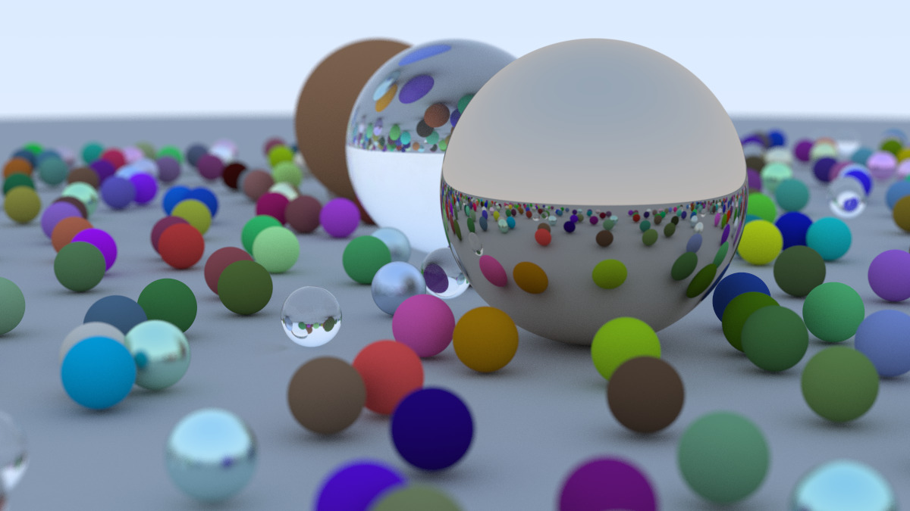

[_Ray Tracing in One Weekend_](https://raytracing.github.io/books/RayTracingInOneWeekend.html)

## Compilation

This project uses `CMake`:

    cmake -B build
    cmake --build build

## Usage

Run `raytrace` and redirect its output to `output.ppm`:

    ./build/raytrace > output.ppm

The rendering looks like this:

